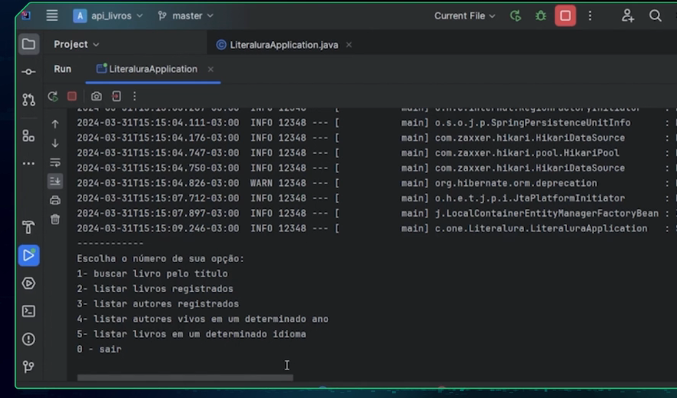

# LitterAlura

---

# Litter Alura - Aplicação de Gerenciamento de Livros

## Descrição

Este projeto é uma aplicação desenvolvida para gerenciar informações sobre livros e autores. Ele permite que você cadastre livros, autores e pesquise por livros baseados no autor, idioma e downloads. A aplicação foi desenvolvida com Spring Boot, JPA e Hibernate.

## Funcionalidades

A aplicação oferece as seguintes funcionalidades através de um menu interativo:

1. **Buscar Livro por título**: Permite buscar um livro utilizando seu título e salvar o resultado no repositório.
2. **Listar livros registrados**: Exibe todos os livros armazenados no repositório.
3. **Listar autores registrados**: Exibe todos os autores dos livros registrados.
4. **Listar autores vivos em determinado ano**: Exibe os autores que estão vivos em um determinado ano.
5. **Listar livros por idiomas**: Exibe os livros registrados filtrados por idioma.

## **Tecnologias Utilizadas**

- **Java 17**
- **Spring Boot 3.x**
- **JPA (Java Persistence API)**
- **Hibernate**
- **H2 Database (para desenvolvimento)**
- **Jackson (para mapeamento JSON)**
- **Maven** (para gerenciamento de dependências)

## Estrutura do Código

### Principais Classes

- **Main**: Contém o menu principal e as operações de interação com o usuário.
- **RequestAPI**: Responsável por realizar as requisições HTTP para a API externa.
- **DataConvert**: Converte os dados JSON recebidos da API para objetos Java.
- **Livro**: Representa os dados de um livro (título, autor, downloads).
- **LivroDTO**: Representa a versão de transferência de dados de um livro.
- **LivroRepository**: Interface para a persistência de dados dos livros no repositório.
- **Info**: Representa a estrutura de resposta da API externa.

### Fluxo de Execução

1. **Menu**: O usuário é apresentado com um menu de opções. O programa aguarda a entrada de uma opção numérica.
2. **Busca de Livro**: Se o usuário optar por buscar um livro por título, o programa faz uma requisição para a API externa e armazena o livro retornado no repositório.
3. **Listagem**: O programa permite listar os livros, autores registrados, ou filtrar autores vivos em determinado ano.


## Como Rodar

1. Clone o repositório:

    ```bash
    git clone <URL_DO_REPOSITORIO>
    ```

2. Compile e execute o projeto:

    ```bash
    mvn clean install
    mvn spring-boot:run
    ```

3. O menu será exibido no terminal e você poderá interagir com a aplicação.

## Endpoints da API Externa

A aplicação utiliza a seguinte URL para buscar dados dos livros:

```
https://gutendex.com/books?search=<TITULO_DO_LIVRO>
```

### Exemplos de Busca

- Para buscar por "Harry Potter":
  
    ```
    https://gutendex.com/books?search=Harry+Potter
    ```

## Contribuição

Se você deseja contribuir para o projeto, siga estas etapas:

1. Faça um fork deste repositório.
2. Crie uma branch para sua feature (`git checkout -b feature/nome-da-feature`).
3. Commit suas alterações (`git commit -am 'Adiciona nova feature'`).
4. Envie a branch para o repositório remoto (`git push origin feature/nome-da-feature`).
5. Abra um pull request.

## Licença

Este projeto é licenciado sob a Licença MIT - veja o arquivo [LICENSE](LICENSE) para mais detalhes.

---

Esse `README` é um bom ponto de partida, sendo adaptável conforme a evolução do projeto.

